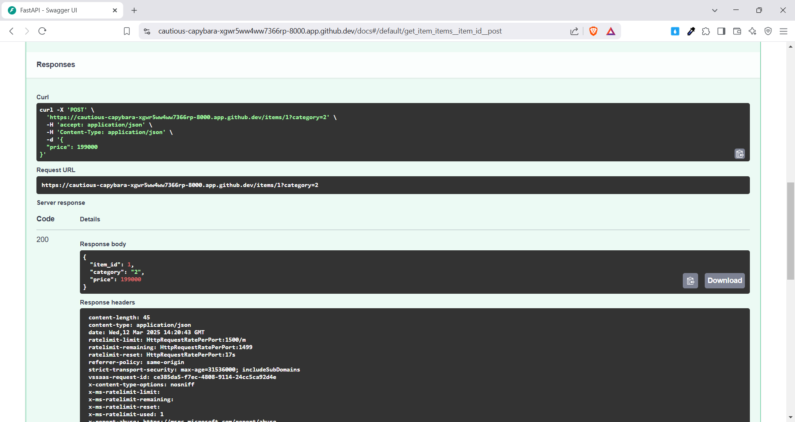
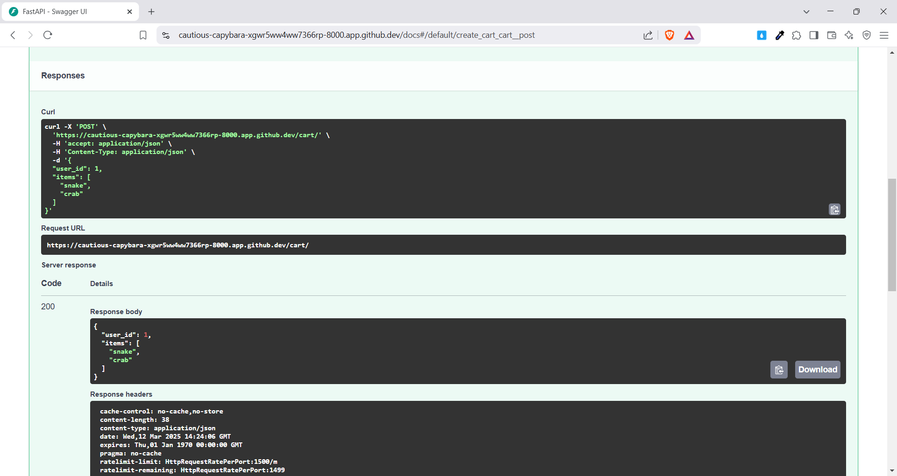
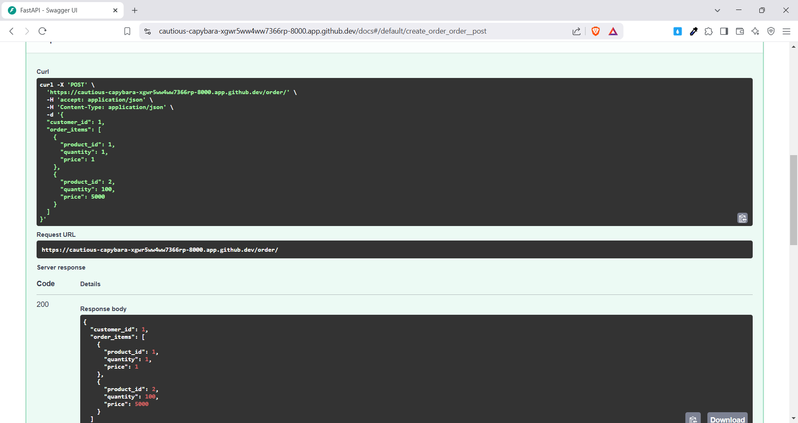

# SOA - On-class Exercise 3  

```sh
Huynh Thanh Liem - 52100813
```

## Description  

This is a FastAPI application built to practice API exercises involving various parameter types, lists, and nested models. The application includes three main exercises:  

1. **Exercise 01**: `/items/{item_id}` - Retrieve information about an item.  
2. **Exercise 02**: `/cart/` - Retrieve information about a user's shopping cart.  
3. **Exercise 03**: `/order/` - Retrieve order details with nested items.  

## Installation  

To run this application, you need to install FastAPI and an ASGI server like `uvicorn`. You can install them using pip:  

```bash
pip install fastapi uvicorn
```  

## Running the Application  

Each exercise can be run separately. To start the application for each exercise, use the following command:  

```bash
# For Exercise 01
uvicorn exercise01.main:app --reload

# For Exercise 02
uvicorn exercise02.main:app --reload

# For Exercise 03
uvicorn exercise03.main:app --reload
```  

## Endpoints  

### 1. Exercise 01: `/items/{item_id}`  

- **Method**: `GET`  
- **Parameters**:  
  - `item_id` (path parameter): Item ID (integer, must be greater than 0).  
  - `category` (query parameter): Item category (string, optional).  
- **Body**:  
  - `price` (float): Item price (must be greater than 0).  
- **Response**: Returns processed item information.  
- **Result**:  
    

### 2. Exercise 02: `/cart/`  

- **Method**: `POST`  
- **Body**:  
  - `user_id` (integer): User ID (must be greater than 0).  
  - `items` (list of strings): List of items (must contain at least one item).  
- **Response**: Returns the received cart information.  
- **Result**:  
    

### 3. Exercise 03: `/order/`  

- **Method**: `POST`  
- **Body**:  
  - `customer_id` (integer): Customer ID (must be greater than 0).  
  - `order_items` (list of order objects): List of order items.  
    - Each order item must include:  
      - `product_id` (integer): Product ID (must be greater than 0).  
      - `quantity` (integer): Quantity (must be 1 or more).  
      - `price` (float): Price (must be greater than 0).  
- **Response**: Returns the received order details.  
- **Result**:  
    

## Technologies Used  

- Python  
- FastAPI  
- Pydantic  
- Uvicorn  

## References  

- [FastAPI Documentation](https://fastapi.tiangolo.com/)  
- [Pydantic Documentation](https://pydantic-docs.helpmanual.io/)